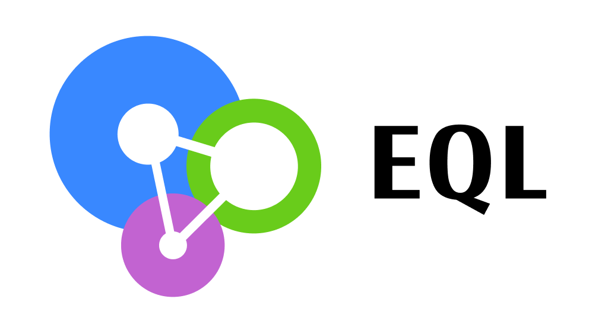

:source-highlighter: coderay
:source-language: clojure
:toc:
:toc-placement: preamble
:sectlinks:
:sectanchors:
:sectnums:
ifdef::env-github,env-cljdoc[]
:tip-caption: :bulb:
:note-caption: :information_source:
:important-caption: :heavy_exclamation_mark:
:caution-caption: :fire:
:warning-caption: :warning:
endif::[]

image:https://img.shields.io/clojars/v/edn-query-language/eql.svg[link=https://clojars.org/edn-query-language/eql]
image:https://cljdoc.xyz/badge/edn-query-language/eql[link=https://cljdoc.xyz/d/edn-query-language/eql/CURRENT]
image:https://github.com/edn-query-language/eql/actions/workflows/test.yml/badge.svg["GitHub actions", link="https://github.com/edn-query-language/eql/actions/workflows/test.yml"]

This repository contains a specification for EQL and a support library to help the development
of tools using it.

== What is EQL?

EQL is a declarative way to make hierarchical (and possibly nested) selections of information about data requirements.

EQL doesn't have its own language; it uses EDN to express the request, taking advantage of
the rich set of primitives provided by it.

==== EQL for selections

An easy way to get started is to think of a map and try to describe its shape. For example:

[source,clojure]
----
{:album/name "Magical Mystery Tour"
 :album/year 1967}
----

By describing the shape, we mean describing the structure but without the values, the previous example can be described using EQL as:

[source,clojure]
----
[:album/name :album/year]
----

Like using `select-keys` to specify which fields to extract from a map. Now let's see
what it looks like for nested structures:

[source,clojure]
----
{:album/name   "Magical Mystery Tour"
 :album/artist {:artist/name "The Beatles"}}

; can be described as:

[:album/name
 ; note the use of a map to express nesting
 {:album/artist
  [:artist/name]}]
----

It works the same to represent nested sequences:

[source,clojure]
----
{:album/name   "Magical Mystery Tour"
 :album/tracks [{:track/name "The Fool On The Hill"}
                {:track/name "All You Need Is Love"}]}

; can be described as:

[:album/name
 {:album/tracks
  [:track/name]}]
----

TIP: Although with just EQL you can't know if a key value is expected to be a single item or a sequence, you
can have this information setup out of band using Clojure specs, if you do so you can instrospect the spec
and detect that, this is not a feature of EQL in any way, just a suggested approach in case you need to know
if the response of a key is a single item or a sequence.

==== EQL for operations

EQL also supports `mutations`, which are like side effect calls to an API. Mutations can
appear on EQL transaction, and they look like Clojure function calls, example:

[source,clojure]
----
[(call-mutation {:data "value"})]
----

More details in <<Mutations>>.

=== Datomic Pull Syntax comparison

On top of the link:https://docs.datomic.com/on-prem/pull.html[Datomic Pull Syntax] expression, EQL also supports:

- <<Parameters>>
- <<Mutations>>
- <<Unions,Union Queries>>

Check the links on each for more details.

The link:https://docs.datomic.com/on-prem/pull.html#attribute-with-options[attribute with options] feature
from the Datomic Pull Syntax is not present in EQL; instead, we provide the parameterized
attributes that can handle arbitrary data to go along the base property.

=== GraphQL comparison

Similar to GraphQL, EQL works as a language to client libraries to communicate data requirements and operations,
there is a good set of intersection in features between both, as:

- a language to describe arbitrarily nested structures
- support for mutations (operations to side effect the world)
- support for parametrization
- union queries for query branching (select query according to some custom definition based on the data)

GraphQL has a type system in its definition, and it is required for a GraphQL system to work. EQL has
no such thing, and it dictates only the syntax but not the semantics. Some features in
GraphQL just doesn't make sense in EQL, like fragments, since EQL is already a data format (EDN),
it's easy to compose data as you would do in a regular Clojure program, for that reason
many features are not necessary because EQL is a parseable data format with all the Clojure
tools already available to operate on top of it. Also read the <<AST Encode/Decode,AST>> section for more information
on how to programmatically manipulate EQL data structures.

== Specification

The following sections explain the features provided by this library, including code examples.
We show how you can work with an AST representation of an EQL expression, which is often
an easier form to manipulate programatically. Of course, we'll also cover how to convert
between EQL and an AST representation (bidirectionally).

In the end of this section you will also find the Clojure Spec formal specification
for the EQL syntax.

=== Query / Transactions

An EQL transaction is represented by an EDN vector.

Examples:

[source,clojure]
----
[] ; empty transaction

; ast

{:type :root, :children []}
----

A transaction that only contains reads is commonly called a `query`, but notice that
at the syntax level, it has no difference.

=== Properties

Properties in `EQL` are expressed as Clojure keywords; they can be simple or qualified
keywords, and they express the property been requested.

Examples:

[source,clojure]
----
[:album/name :album/year]

; ast

{:type     :root
 :children [{:type :prop, :dispatch-key :album/name, :key :album/name}
            {:type :prop, :dispatch-key :album/year, :key :album/year}]}
----

=== Joins

Joins are used to describe nesting in the request transaction. They are represented as
EDN maps, always with a single entry, the entry key is the property to join on, and the
entry value is a sub-query to run.

Examples:

[source,clojure]
----
[{:favorite-albums
  [:album/name :album/year]}]

; ast

{:type     :root
 :children [{:type         :join
             :dispatch-key :favorite-albums
             :key          :favorite-albums
             :query        [:album/name :album/year]
             :children     [{:type :prop, :dispatch-key :album/name, :key :album/name}
                            {:type :prop, :dispatch-key :album/year, :key :album/year}]}]}
----

Nested joins example:

[source,clojure]
----
[{:favorite-albums
  [:album/name :album/year
   {:album/tracks
    [:track/name
     :track/duration]}]}]

; ast

{:type :root
 :children
 [{:type         :join
   :dispatch-key :favorite-albums
   :key          :favorite-albums

   :query        [:album/name
                  :album/year
                  {:album/tracks [:track/name :track/duration]}]

   :children     [{:type :prop, :dispatch-key :album/name, :key :album/name}
                  {:type :prop, :dispatch-key :album/year, :key :album/year}
                  {:type         :join
                   :dispatch-key :album/tracks
                   :key          :album/tracks
                   :query        [:track/name :track/duration]
                   :children     [{:type :prop, :dispatch-key :track/name, :key :track/name}
                                  {:type         :prop
                                   :dispatch-key :track/duration
                                   :key          :track/duration}]}]}]}
----

=== Idents

Idents are represented by a vector with two elements, where the first is a keyword and
the second can be anything. They are like link:http://blog.datomic.com/2014/02/datomic-lookup-refs.html[lookup refs on Datomic],
in general, they can provide an address-like thing, and their use and semantic might
vary from system to system.

Examples:

[source,clojure]
----
[[:customer/id 123]]

; ast

{:type :root
 :children [{:type :prop, :dispatch-key :customer/id, :key [:customer/id 123]}]}
----

Note that this time in the AST the `:dispatch-key` and `:key` got different values this
time, the `:dispatch-key` been just the `ident key` while the `:key` contains the
full thing.

It's common to use an ident as a join key to start a query for some entity:

[source,clojure]
----
[{[:customer/id 123]
  [:customer/name :customer/email]}]

; ast

{:type     :root
 :children [{:type         :join
             :dispatch-key :customer/id
             :key          [:customer/id 123]
             :query        [:customer/name :customer/email]
             :children     [{:type :prop, :dispatch-key :customer/name, :key :customer/name}
                            {:type         :prop
                             :dispatch-key :customer/email
                             :key          :customer/email}]}]}
----

=== Parameters

EQL properties, joins, and idents have support for parametrization. This allows the
query to provide an extra dimension of information about the requested data. A parameter
is expressed by wrapping the thing with an EDN list, like so:

[source,clojure]
----
; without params
[:foo]

; with params
[(:foo {:with "params"})]

; ast

{:type     :root
 :children [{:type         :prop
             :dispatch-key :foo
             :key          :foo
             :params       {:with "params"}
             :meta         {:line 1, :column 15}}]}
----

Note on the AST side it gets a new `:params` key. Params *must* always be maps, the
map values can be anything. Here are more examples of parameterizing queries:

[source,clojure]
----
; ident with params

[([:ident "value"] {:with "param"})]

{:type     :root
 :children [{:type         :prop
             :dispatch-key :ident
             :key          [:ident "value"]
             :params       {:with "param"}
             :meta         {:line 1, :column 15}}]}

; join with params wrap the key with the list

[{(:join-key {:with "params"})
  [:sub-query]}]

{:type     :root
 :children [{:type         :join
             :dispatch-key :join-key
             :key          :join-key
             :params       {:with "params"}
             :meta         {:line 1, :column 16}
             :query        [:sub-query]
             :children     [{:type         :prop
                             :dispatch-key :sub-query
                             :key          :sub-query}]}]}

; ident join with params

[{([:ident "value"] {:with "params"})
  [:sub-query]}]

{:type     :root
 :children [{:type         :join
             :dispatch-key :ident
             :key          [:ident "value"]
             :params       {:with "params"}
             :meta         {:line 1 :column 16}
             :query        [:sub-query]
             :children     [{:type         :prop
                             :dispatch-key :sub-query
                             :key          :sub-query}]}]}

; alternate syntax to add params on joins (wrap the entire map, AST result is the same)

[({:join-key
   [:sub-query]}
  {:with "params"})]

{:type     :root
 :children [{:type         :join
             :dispatch-key :join-key
             :key          :join-key
             :params       {:with "params"}
             :meta         {:line 1, :column 16}
             :query        [:sub-query]
             :children     [{:type         :prop
                             :dispatch-key :sub-query
                             :key          :sub-query}]}]}
----

WARNING: You'll need to use quote and unquote in CLJ files for calls, otherwise the lists will be evaluated as Clojure calls. Quote is not necessary in EDN files.

=== Query Meta

Metadata can be stored on a query. The AST will encode the metadata so that transformations to/from an AST can preserve it.

[source,clojure]
----
(with-meta [] {:meta "data"})

; ast

{:type :root, :children [], :meta {:meta "data"}}
----

=== Unions

In EQL unions are used to specify polymorphic requirements, that means depending on some
condition a different query might be chosen to fulfill the requirements. For example,
a messaging app may have a single list, and each entry on the chat log can be a `message`,
`audio` or `photo`, each having its own query requirement. Here it is in code:

[source,clojure]
----
; message query
[:message/id :message/text :chat.entry/timestamp]

; audio query
[:audio/id :audio/url :audio/duration :chat.entry/timestamp]

; photo query
[:photo/id :photo/url :photo/width :photo/height :chat.entry/timestamp]

; list query
[{:chat/entries ???}] ; what goes there?
----

Now to express this polymorphic requirement as the sub-query of the `:chat/entries` list
we can use a map as the join value, and each entry on this map represents a possible
sub-query. The way this information is used is up to the parser implementation; EQL only
defines the syntax. Here are some examples of how it could be written:

[source,clojure]
----
; in this example, the selection is made by looking if the processed entry contains
; some value on the key used for its selection
[{:chat/entries
  {:message/id [:message/id :message/text :chat.entry/timestamp]
   :audio/id   [:audio/id :audio/url :audio/duration :chat.entry/timestamp]
   :photo/id   [:photo/id :photo/url :photo/width :photo/height :chat.entry/timestamp]}}]

; in this case, we give a type name and use as the key, this usually requires some
; out of band configuration to know how to pull this data from each entry to use
; as the comparison
[{:chat/entries
  {:entry.type/message [:message/id :message/text :chat.entry/timestamp]
   :entry.type/audio   [:audio/id :audio/url :audio/duration :chat.entry/timestamp]
   :entry.type/photo   [:photo/id :photo/url :photo/width :photo/height :chat.entry/timestamp]}}]

; ast for the first example

{:type :root
 :children
 [{:type         :join
   :dispatch-key :chat/entries
   :key          :chat/entries
   :query        {:message/id [:message/id :message/text :chat.entry/timestamp]
                  :audio/id   [:audio/id :audio/url :audio/duration :chat.entry/timestamp]
                  :photo/id   [:photo/id
                               :photo/url
                               :photo/width
                               :photo/height
                               :chat.entry/timestamp]}
   :children     [{:type :union
                   :query
                         {:message/id [:message/id :message/text :chat.entry/timestamp]
                          :audio/id   [:audio/id :audio/url :audio/duration :chat.entry/timestamp]
                          :photo/id   [:photo/id
                                       :photo/url
                                       :photo/width
                                       :photo/height
                                       :chat.entry/timestamp]}
                   :children
                         [{:type      :union-entry
                           :union-key :message/id
                           :query     [:message/id :message/text :chat.entry/timestamp]
                           :children  [{:type :prop, :dispatch-key :message/id, :key :message/id}
                                       {:type :prop, :dispatch-key :message/text, :key :message/text}
                                       {:type         :prop
                                        :dispatch-key :chat.entry/timestamp
                                        :key          :chat.entry/timestamp}]}
                          {:type      :union-entry
                           :union-key :audio/id
                           :query     [:audio/id :audio/url :audio/duration :chat.entry/timestamp]
                           :children  [{:type :prop, :dispatch-key :audio/id, :key :audio/id}
                                       {:type :prop, :dispatch-key :audio/url, :key :audio/url}
                                       {:type         :prop
                                        :dispatch-key :audio/duration
                                        :key          :audio/duration}
                                       {:type         :prop
                                        :dispatch-key :chat.entry/timestamp
                                        :key          :chat.entry/timestamp}]}
                          {:type      :union-entry
                           :union-key :photo/id
                           :query     [:photo/id
                                       :photo/url
                                       :photo/width
                                       :photo/height
                                       :chat.entry/timestamp]
                           :children  [{:type :prop, :dispatch-key :photo/id, :key :photo/id}
                                       {:type :prop, :dispatch-key :photo/url, :key :photo/url}
                                       {:type :prop, :dispatch-key :photo/width, :key :photo/width}
                                       {:type :prop, :dispatch-key :photo/height, :key :photo/height}
                                       {:type         :prop
                                        :dispatch-key :chat.entry/timestamp
                                        :key          :chat.entry/timestamp}]}]}]}]}
----

=== Mutations

Mutations in EQL are used to represent operation calls, usually to do something that will
cause a side effect. Mutations as data allows that operation to behave much like event
sourcing, and can be transparently applied locally, across a network, onto an event bus, etc.

A mutation is represented by a list of two elements; the first is the symbol
that names the mutation, and the second is a map with input data.

[source,clojure]
----
[(call.some/operation {:data "input"})]

; ast

{:type :root
 :children
 [{:dispatch-key call.some/operation
   :key          call.some/operation
   :params       {:data "input"}
   :meta         {:line 610, :column 17}
   :type         :call}]}
----

NOTE: Mutations and parameters are very similar, their main difference
is that once uses symbols as keys, and the other uses one of the read options (properties,
idents, joins).

The EQL notation does not technically limit the combination of expressions that contain
both query and mutation elements; however, implementations of EQL processing may choose
to make restrictions on these combinations in order to enforce particular semantics.

==== Mutation Joins

A mutation may have a return value, and that return value can be a graph; therefore, it
makes sense that EQL support the ability to describe what portion of the available returned
graph should be returned. The support for mutation graph return values is done by combining
the syntax of a join with the syntax of a mutation:

[source,clojure]
----
[{(call.some/operation {:data "input"})
  [:response :key-a :key-b]}]

; ast

{:type :root
 :children
 [{:dispatch-key call.some/operation
   :key          call.some/operation
   :params       {:data "input"}
   :meta         {:line 612 :column 18}
   :type         :call
   :query        [:response :key-a :key-b]
   :children     [{:type :prop, :dispatch-key :response, :key :response}
                  {:type :prop, :dispatch-key :key-a, :key :key-a}
                  {:type :prop, :dispatch-key :key-b, :key :key-b}]}]}
----

== Library

The package `edn-query-language.core` provides a suite of specs to validate queries and
ASTs. It also provides generators for the query and helper functions to common
query operations.

=== Clojure Specs

The EQL library provides specs to validate and generate queries.

==== Validation

You can validate the query syntax using link:https://clojure.org/guides/spec[clojure.spec], here is an example:

[source,clojure]
----
(s/valid? ::eql/query [:sample :query]) ; => true
(s/valid? ::eql/query [#{:set}]) ; => false
(s/valid? ::eql/query ['(call/op {})]) ; => true
----

NOTE: `s` is alias for `clojure.spec.alpha`

You can use spec explain feature for more details:

[source,clojure]
----
(s/explain ::eql/query [#{:set}])
; In: [0] val: #{:set} fails spec: :edn-query-language.core/mutation-expr at: [:mutation :mutation] predicate: seq?
; In: [0] val: #{:set} fails spec: :edn-query-language.core/mutation-join at: [:mutation :mutation-join] predicate: map?
; In: [0] val: #{:set} fails spec: :edn-query-language.core/property at: [:prop] predicate: keyword?
; In: [0] val: #{:set} fails spec: :edn-query-language.core/join at: [:join] predicate: map?
; In: [0] val: #{:set} fails spec: :edn-query-language.core/ident at: [:ident] predicate: vector?
; In: [0] val: #{:set} fails spec: :edn-query-language.core/param-expr at: [:param-exp] predicate: seq?
; In: [0] val: #{:set} fails spec: :edn-query-language.core/special-property at: [:special] predicate: #{(quote *)}
----

I suggest you check the link:https://github.com/edn-query-language/eql/blob/master/src/edn_query_language/core.cljc#L133-L196[sources for the specs] for more details on parts that compose
it, they will stay consistent and can be used to validate parts of the transaction as well.

==== Generation

EQL also provides built-in generators, the main intended usage for it is to write generative
tests for parser implementations.

Basic example to generate random queries:

[source,clojure]
----
(gen/sample (s/gen ::query) 10)
=>
([]
 []
 [(:?./*_ {}) :z/ZH]
 []
 [#:J{:w {:c/!V [#:YY{:u [:u1/X?!
                          #:r94{:*+ [#:aG{:YA 2} :t!o/Ya1 :XL/HR #:!-Q{:b_ []}]}
                          :OP/E]}
                 :.qE/Nd-],
          :j./!T [[:p/h*y :f?1]
                  #:s*{:-W []}
                  (NG_
                   {[] #{}, [4] (0.5 :_ -3 -Ch), #{} #{}, #{-1 {##-Inf ?.1/e?A}} {}})],
          :z/s+ []}}
  :-_/_
  :H/E
  :Y/xD]
 [:?7/w :iO/! (:r/!N {{-2.0 false} [], [] [], [:P7] [0 J1]})]
 [:+Bi/-K :!8*/r0 :?/Cio]
 [:*.-/R* :+BT/W :-l8/c :Ih/V [:RE/- "0>WwI`u"] :H/vT]
 [:z+8/g]
 [])
----

NOTE: `gen` is alias for `clojure.test.check.generators`

Although fully random queries can be interesting to test some parser edge cases, in many
situations you will may want to constraint how the query is generated, with this in mind
EQL provides a way to enable this kind of customization. To get a sense of what you can
customize link:https://github.com/edn-query-language/eql/blob/master/src/edn_query_language/core.cljc#L10-L121[you can take a look at the default implementation for each default generator],
any of those keys can be tuned to constraint how the query is generated.

To demonstrate how to use this, let's customize the generator to limit the properties it generates
to a fixed set we pre defined:

[source,clojure]
----
(gen/sample (eql/make-gen {::eql/gen-property ; <1>
                       (fn [_] (gen/elements [:id :name :title :foo :bar]))}
              ::eql/gen-query) ; <2>
  10)
=>
([]
 []
 []
 [[:X/q6 1] :name :title]
 [({:title [(L {#{} [], () [], #{-5} ()})
            (:name {{#{} {}} :., {} {}})
            {:name [:bar :title]}]}
   {[*+-] #{0.5625 #uuid"edf051fb-ab28-42d0-a941-152c4e87b060"},
    #{#uuid"712e7415-5148-400b-99db-cfb79004700e" -1/2} (),
    {} (:F/le9 #uuid"5ad52713-d13a-4888-bd92-2d1541c0387b" "" true)})
  {(:foo
    {[(2.0 false) z/NO] [I./j #uuid"eef64a1d-8055-4ae7-95be-06bdc4f9cefd"], {} [""]}) [:id
                                                                                       ({:id [:name
                                                                                              *]}
                                                                                        {})]}]
 [:id :id]
 [{:foo [:name * [:mO/D MZ_/e0Z] :bar :foo]}]
 []
 [:bar]
 [:foo])
----

<1> We send a map to `eql/make-gen` to override some of the generator settings, any non
defined keys will fallback to default implementation
<2> Select which generator to use, this is useful to generate only sub-parts if needed

One more example changing many definitions:

[source,clojure]
----
(let [system (assoc generators
               ::gen-params
               (fn [_] (gen/map (gen/elements [:param :foo/param]) gen/string-ascii))

               ::gen-property
               (fn [_] (gen/elements [:id :name :title :foo :bar :other :price :namespaced/value]))

               ::gen-ident-key
               (fn [_] (gen/elements [:user/by-id :other/by-id]))

               ::gen-ident-value
               (fn [_] gen/string-ascii)

               ::gen-mutation-key
               (fn [_] (gen/elements '[do-something create/this-thing operation.on/space])))]
  (gen/sample ((::gen-query system) system)))
=>
([]
 [{:other []}]
 []
 []
 []
 [{:price [{[:user/by-id "!"] []} :title]} :id]
 [:bar {[:other/by-id "@"] [:foo :other :name]}]
 [:name :id]
 [:price :title :id :name]
 [:foo
  ({:bar [[:user/by-id ""] :price {:id [:other]} :other]} {})
  :other
  :namespaced/value
  {:name [:name
          {:bar [:name
                 :bar
                 :namespaced/value
                 ({[:user/by-id "AeA$;"] [:foo]}
                  {:foo/param "_+y9ihY", :param "Y@p5Bd5B"})
                 :id
                 :namespaced/value
                 :name]}]}
  :id])
----

If you wanna see an even more advanced usage, you can check link:https://github.com/wilkerlucio/pathom/blob/master/src/com/wsscode/pathom/connect/gen.cljc[Pathom connect generator], which
uses the Pathom connect index to generate queries that are valid according to the user property graph.

==== Removing specs on Clojurescript

If you are not using the specs provided by EQL you can free some build space by
eliding then. To do that you need to set the Clojurescript compiler options with:

[source,clojure]
----
{:closure-defines {edn-query-language.core.INCLUDE_SPECS false}}
----

=== AST Encode/Decode

To convert between query and AST, EQL provides the helper functions `eql/query->ast` and
`eql/ast->query`. Here are some example usages:

[source,clojure]
----
(eql/query->ast [:foo])
; => {:type :root, :children [{:type :prop, :dispatch-key :foo, :key :foo}]}

(eql/ast->query {:type :root, :children [{:type :prop, :dispatch-key :foo, :key :foo}]})
; => [:foo]
----

=== API Docs

Check the complete API docs at link:https://cljdoc.org/d/edn-query-language/eql/CURRENT/api/edn-query-language.core[EQL cljdoc page].

//== History
//
//EQL is a derived language, it's initial syntax was defined by link:https://docs.datomic.com/pull.html[Datomic Pull Syntax], later extended
//by link:https://github.com/omcljs/om[Om.next].

//== Projects using EQL
//
//- link:http://fulcro.fulcrologic.com/[Fulcro]
//- link:https://github.com/wilkerlucio/pathom[Pathom]
//- link:https://github.com/walkable-server/walkable[Walkable]
